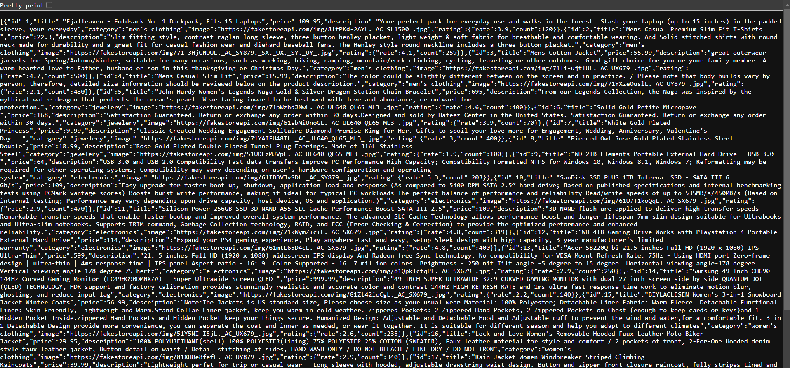

# FastAPI Firebase and FakeStore Integration

## Overview
This project demonstrates a FastAPI app that integrates with Firebase and Fake Store API.


   

## Endpoints

- `/hello`: Returns "Hello World"
- `/add`: Stores timestamp data in Firebase Firestore
- `/fakestore/products`: Lists all products from Fake Store
- `/fakestore/cart/{product_id}`: Adds a product to the cart
- `/fakestore/cart`: Lists all items in the cart

## Installation

1. Install dependencies:
   ```bash
   pip install -r requirements.txt
